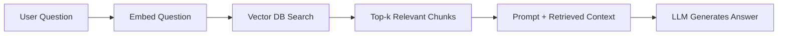
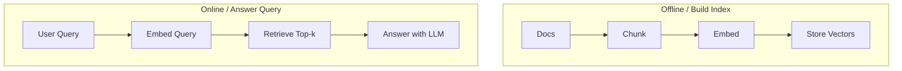
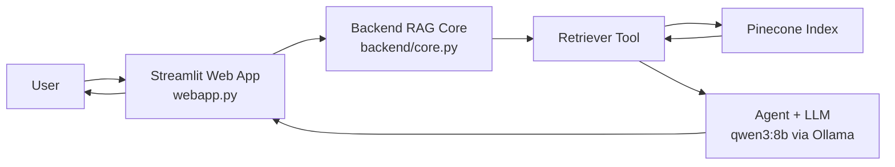
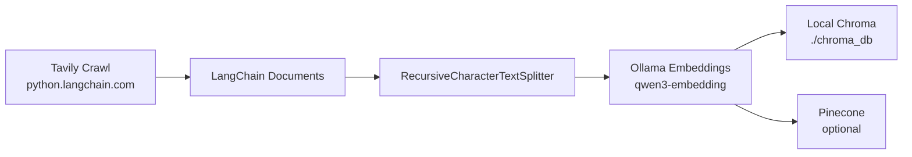
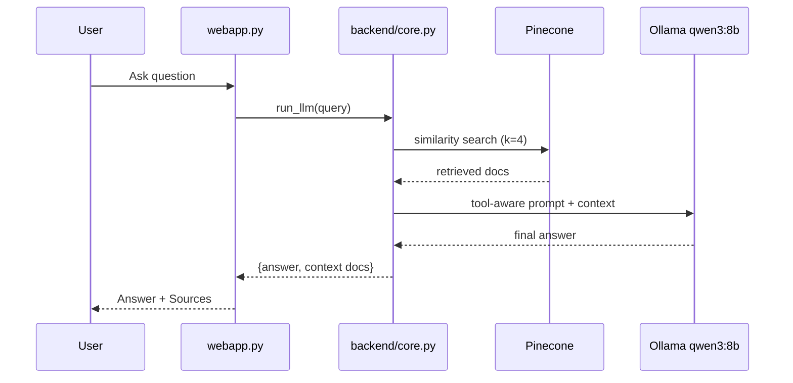
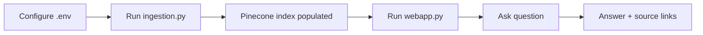

# LangChain RAG Assistant (Ollama + Pinecone + Streamlit)

<p align="center">
  
</p>

<p align="center">
  
  
  
  
  
  
  
</p>

This project builds a Retrieval-Augmented Generation (RAG) assistant using:

- `Ollama` for local open-source chat and embedding models
- `Pinecone` as the production vector database
- `Chroma` as local vector storage during ingestion
- `Tavily` to crawl documentation content
- `Streamlit` as the web chat UI
- `LangChain` for orchestration (tool calling + retrieval)
- `LangSmith` (optional) for tracing and debugging

## What This Repository Implements

<p align="left">
  
  
  
</p>

There are 3 main runtime components:

1. `ingestion.py`
   - Crawls `https://python.langchain.com/` with Tavily
   - Converts crawled pages to `Document` objects
   - Splits documents into chunks
   - Embeds chunks with `qwen3-embedding` from Ollama
   - Stores vectors in local Chroma and optionally Pinecone

2. `backend/core.py`
   - Uses `qwen3:8b` (chat model) and `qwen3-embedding` (query embedding)
   - Retrieves relevant chunks from Pinecone
   - Uses a LangChain agent with a retrieval tool
   - Returns answer + retrieved context

3. `webapp.py`
   - Streamlit chat interface
   - Calls `backend.core.run_llm()`
   - Displays answer and source links from retrieved documents

## Important Behavior (Read This First)

- `ingestion.py` always writes vectors to local Chroma (`./chroma_db`).
- `ingestion.py` writes to Pinecone only when Pinecone env is configured.
- `backend/core.py` retrieves from Pinecone (not from local Chroma).
- If Pinecone is empty or misconfigured, the web app cannot retrieve useful context.

## RAG Basics (Beginner Visual)

<p align="left">
  
  
  
  
</p>

RAG means **Retrieval-Augmented Generation**:

1. `Retrieval`: find relevant text chunks from your knowledge base.
2. `Augmented`: attach those chunks to the model prompt.
3. `Generation`: model answers using retrieved context.

Without RAG, model answers from its training knowledge only.  
With RAG, model can answer from your own docs.

### Popular Official RAG Illustration

<p align="center">
  
</p>

Source: [Pinecone Learning Center - Retrieval-Augmented Generation (RAG)](https://www.pinecone.io/learn/retrieval-augmented-generation/)

### Concept Flow



### Why This Helps

- Better factual grounding from your data.
- Works with large documentation that cannot fit directly into one prompt.
- Easy to update knowledge by re-ingesting docs (no model retraining needed).

### Simple Example

Question: `How do I create a retriever in LangChain?`

What happens:

1. The question is embedded to a vector.
2. Pinecone returns top related chunks from indexed docs.
3. The chunks are passed to `qwen3:8b`.
4. The model answers and cites relevant sources.

### Two-Phase Mental Model



## Architecture



## Ingestion Architecture



## Query-Time Architecture



---

## Prerequisites

<p align="left">
  
  
  
  
  
</p>

- Python `>=3.13` (as defined in `pyproject.toml`)
- [uv](https://docs.astral.sh/uv/) (recommended) or pip
- [Ollama](https://ollama.com/) installed and running
- Pinecone account, API key, and an index with correct embedding dimension
- Tavily API key
- Optional: LangSmith account for tracing

## Quickstart (Minimal)

1. Install deps: `uv sync`
2. Start Ollama and pull models:
   - `ollama serve`
   - `ollama pull qwen3:8b`
   - `ollama pull qwen3-embedding`
3. Configure `.env` (Ollama, Pinecone, Tavily, optional LangSmith)
4. Run ingestion: `uv run python ingestion.py`
5. Run app: `uv run streamlit run webapp.py`

If you skip step 4, chat retrieval quality will be poor because Pinecone has no indexed docs.

## 1) Install Dependencies

Using `uv`:

```bash
uv sync
```

If you already have `.venv`, ensure packages are synced:

```bash
uv sync --active
```

## 2) Set Up Ollama (Open-Source Models)

### Install and run Ollama

- Install Ollama from: https://ollama.com/download
- Start server (if not auto-started):

```bash
ollama serve
```

### Pull required models

```bash
ollama pull qwen3:8b
ollama pull qwen3-embedding
```

### Verify models are available

```bash
curl http://localhost:11434/api/tags
```

If you run Ollama on another host, set `OLLAMA_BASE_URL` accordingly.

---

## 3) Create a Pinecone Account and Use It Here

### Create account

1. Go to https://www.pinecone.io/ and sign up.
2. Create or select a project in Pinecone console.
3. Generate an API key and copy it.

### Create an index

1. Open Pinecone console -> **Indexes** -> **Create index**.
2. Choose an index name, for example: `langchain-docs-2025`.
3. Metric: use `cosine` (common for text embeddings).
4. Dimension: must match your embedding vector length.

Because embedding dimensions can vary by model/config, verify dimension with this script:

```bash
uv run python - <<'PY'
import os
from langchain_ollama import OllamaEmbeddings

base_url = os.getenv("OLLAMA_BASE_URL", "http://localhost:11434")
emb = OllamaEmbeddings(model="qwen3-embedding", base_url=base_url)
vec = emb.embed_query("dimension check")
print("Embedding dimension:", len(vec))
PY
```

Use that printed value as Pinecone index dimension.

### Configure Pinecone in this repo

Set in `.env`:

```env
PINECONE_API_KEY=your_pinecone_api_key
PINECONE_INDEX_NAME=langchain-docs-2025
# optional fallback key used by code
INDEX_NAME=langchain-docs-2025
# optional toggle (default true in ingestion.py)
ENABLE_PINECONE=true
```

How the code uses it:

- `ingestion.py` writes to local Chroma always, and to Pinecone if enabled/configured.
- `backend/core.py` retrieves from Pinecone for answering queries.
- `webapp.py` uses `backend/core.py`, so it also depends on Pinecone retrieval.

---

## 4) Set Up Tavily (for Crawling Docs)

`ingestion.py` uses Tavily tools (`TavilyCrawl`) to fetch docs pages.

1. Create account: https://tavily.com/
2. Generate API key
3. Add to `.env`:

```env
TAVILY_API_KEY=your_tavily_api_key
```

---

## 5) Set Up LangSmith (Optional, Recommended)

LangSmith helps inspect chain/tool traces.

### Create account

1. Go to https://smith.langchain.com/
2. Sign in and create an API key

### Add tracing env vars

Add to `.env`:

```env
LANGSMITH_API_KEY=your_langsmith_api_key
LANGCHAIN_PROJECT=langchain-learning
LANGCHAIN_TRACING_V2=true
```

If your LangSmith setup uses the newer tracing key, you can also set:

```env
LANGSMITH_TRACING=true
```

### How to verify LangSmith is working

1. Run any pipeline call (`ingestion.py`, `backend/core.py`, or `webapp.py` chat).
2. Open https://smith.langchain.com/
3. Select project name from `LANGCHAIN_PROJECT`.
4. Confirm you can see runs/traces (LLM calls, tool calls, timings).

---

## 6) `.env` Template

Use this as a starting point:

```env
# Ollama
OLLAMA_BASE_URL=http://localhost:11434

# Pinecone
PINECONE_API_KEY=
PINECONE_INDEX_NAME=langchain-docs-2025
INDEX_NAME=langchain-docs-2025
ENABLE_PINECONE=true

# Tavily
TAVILY_API_KEY=

# LangSmith (optional)
LANGSMITH_API_KEY=
LANGCHAIN_PROJECT=langchain-learning
LANGCHAIN_TRACING_V2=true
# LANGSMITH_TRACING=true
```

---

## Run the Project

### End-to-End Run Flow (Visual)



### A) Ingest documentation into vector stores

```bash
uv run python ingestion.py
```

What happens:

- Preflight checks validate Ollama server + models
- Tavily crawls documentation URLs
- Documents are chunked
- Chunks are embedded
- Vectors are stored in Chroma and optionally Pinecone

### B) Test backend core directly

```bash
uv run python backend/core.py
```

Or call programmatically:

```bash
uv run python - <<'PY'
from backend.core import run_llm
res = run_llm("What are deep agents?")
print("Answer:\n", res["answer"])
print("Context docs:", len(res["context"]))
PY
```

### C) Run web chat app

```bash
uv run streamlit run webapp.py
```

Do not run Streamlit app with plain `python webapp.py`. If you do, the script prints the correct run command.

---

## Implementation Notes

### `ingestion.py`

Main functions:

- `run_preflight_checks()`
  - Verifies Ollama server is reachable
  - Confirms chat and embedding model availability
  - Validates embedding endpoint returns numeric vector

- `build_active_vectorstores()`
  - Always enables local Chroma
  - Enables Pinecone when env is configured

- `index_documents_async()`
  - Batches chunk writes
  - Writes concurrently to each active vector store
  - Reports per-store success/failure

### `backend/core.py`

Main components:

- `model = ChatOllama(model="qwen3:8b", ...)`
- `embeddings = OllamaEmbeddings(model="qwen3-embedding", ...)`
- Pinecone retriever (`k=4` similarity search)
- Tool function `retrieve_context()` returns:
  - serialized content (for model)
  - raw docs artifact (for programmatic context)

`ToolMessage` usage:

- LangChain stores tool outputs in `ToolMessage`
- Artifact from `retrieve_context` is extracted and returned in final payload

### `webapp.py`

- Streamlit chat UI with session history
- Calls `backend.core.run_llm()`
- Displays model answer
- Displays unique source list under expander

---

## Troubleshooting

| Problem | Likely Cause | Fix |
|---|---|---|
| Ollama preflight timeout | Ollama not running / wrong `OLLAMA_BASE_URL` | Start Ollama (`ollama serve`), verify URL |
| Model not found | `qwen3:8b` or `qwen3-embedding` not pulled | Run `ollama pull qwen3:8b` and `ollama pull qwen3-embedding` |
| Pinecone not used in ingestion | Missing `PINECONE_API_KEY` or disabled flag | Set `PINECONE_API_KEY`, keep `ENABLE_PINECONE=true` |
| Empty/weak answers | Index empty or retrieval mismatch | Re-run ingestion, verify index name and embedding model match |
| Streamlit warnings about ScriptRunContext | App launched with plain Python | Use `streamlit run webapp.py` |
| No LangSmith traces | Tracing env vars missing | Set `LANGSMITH_API_KEY` + tracing vars in `.env` |

---

## Security Notes

- Do not commit `.env`.
- Treat API keys as secrets.
- Rotate keys if leaked.

---

## Helpful Links

- Ollama: https://ollama.com/
- Pinecone: https://www.pinecone.io/
- Tavily: https://tavily.com/
- LangSmith: https://smith.langchain.com/
- Streamlit: https://streamlit.io/
- LangChain docs: https://python.langchain.com/
